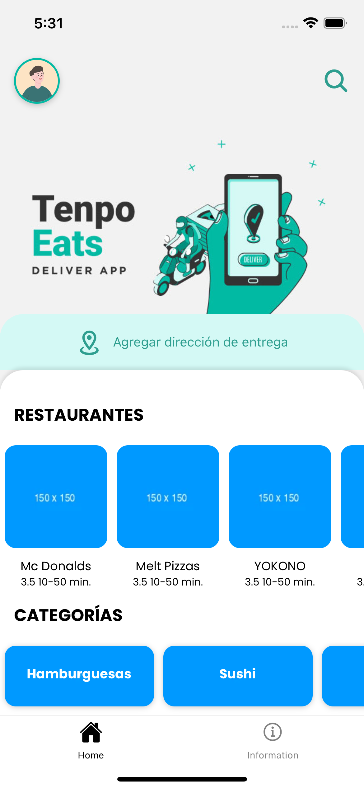
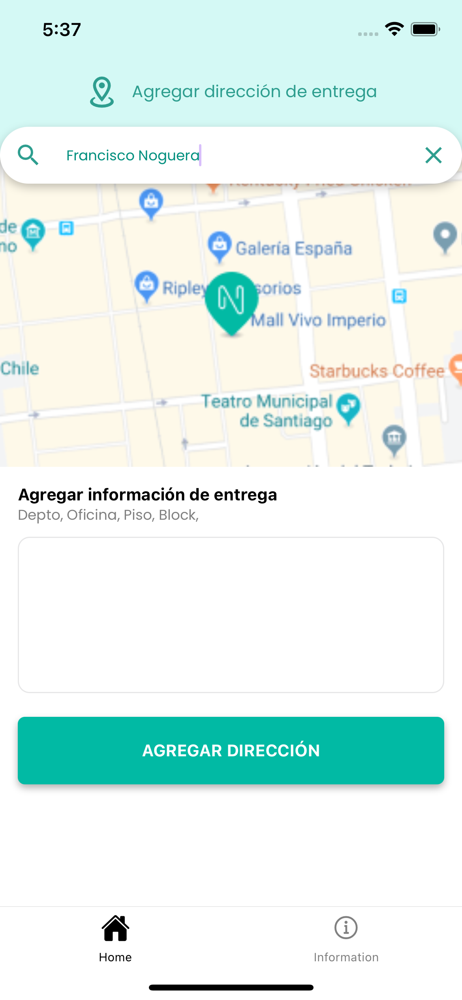
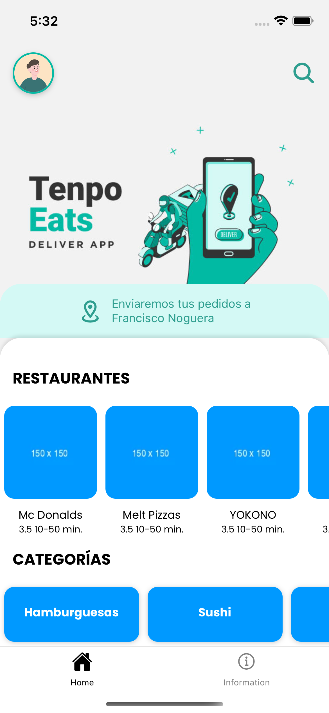
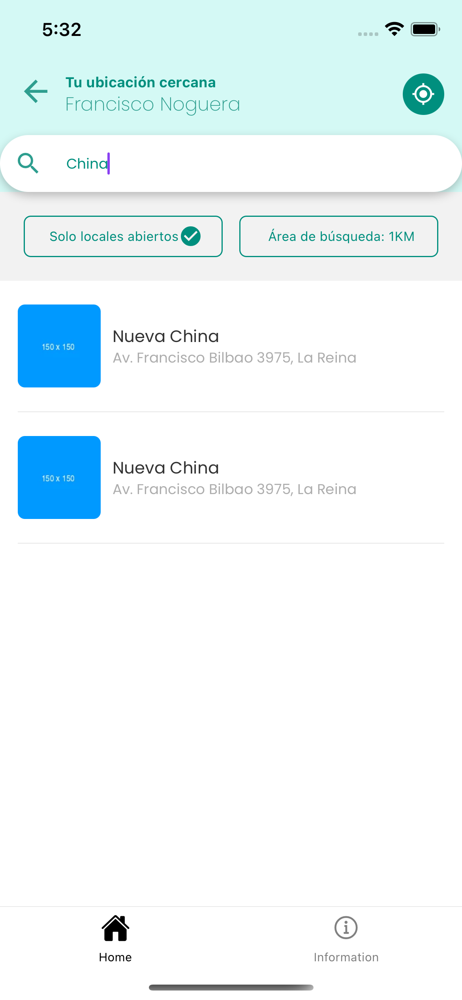
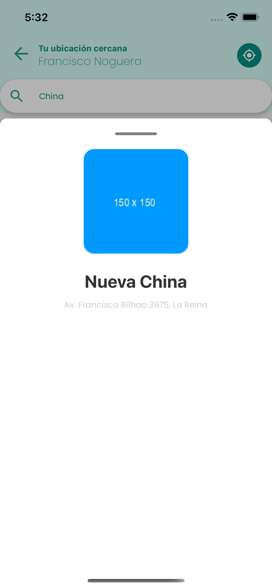
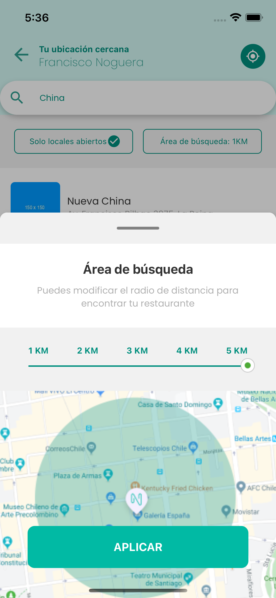
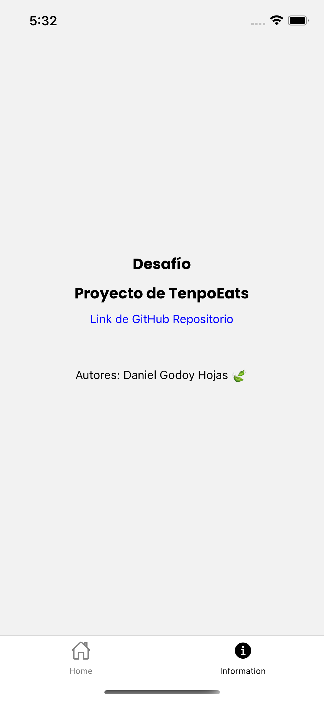

# App TenpoEats

_Una app para la búsqueda de restaurantes. Ideal para personas que quieren comer algo rico en formato delivery. Puedes revisar la app React Native_

## Comenzando 🚀

_Estas instrucciones te permitirán obtener una copia del proyecto en funcionamiento en tu máquina local para propósitos de desarrollo y pruebas._

### Instalación 🔧

_Instalar todas las dependencias del proyecto realizando lo siguiente:_

```
npm install o npm i || yarn
```

### Despliegue 📦

_Para levantar el proyecto de manera local se debe realizar lo siguiente:_

```
npm run start || yarn start
```

### Instalar Pod (dependencies) 📦

_Instalar Pod iOS_

```
cd ios && pod install && cd ..
```

### Ejecutar 🚀

_Ejecutar la aplicación a través del Simulador o en un dispositivo real._

```
yarn ios
yarn android
```

## Uso de 🛠️

- [React Native](https://reactnative.dev/)
- [Redux](https://es.redux.js.org/)
- [Redux Thunk](https://github.com/reduxjs/redux-thunk)
- [React Navigation](https://reactnavigation.org/)
- [Fonts Poppins](https://fonts.google.com/specimen/Poppins)

## Screenshot 📸















## Autores ✒️

- **Daniel Godoy Hojas 🍃** - [dghojas](https://github.com/dghojas)
